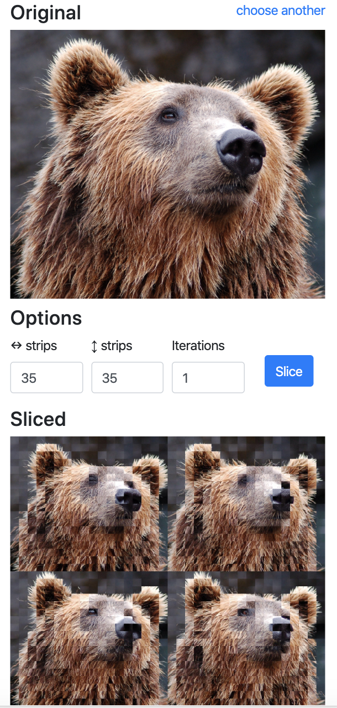

##SliceDog

[This thing](https://i.imgur.com/w59YRy5.gifv), as a service.

Upload images and slice them up to create low resolution (arsty) image grids.

Created with Django, run using docker-compose, with images stored in a GCP bucket.

####Running locally
 - Create a GCP bucket to store the images.
 - Generate GCP service account keys with permissions to write/read from this bucket.
 - Fill in `docker-compose.yaml` as required to copy these keys into the container.
 - Run `docker-compose up`
 - Go to `localhost:80`
 
If running outside of `localhost`, remember to append the host name to `ALLOWED_HOSTS` in `slicedog/settings.py`

####Possible improvements

 - Running locally without needing GCP setup
 - Deleting images
 - Connection to an external DB (currently creates a new SQLite DB on every run)